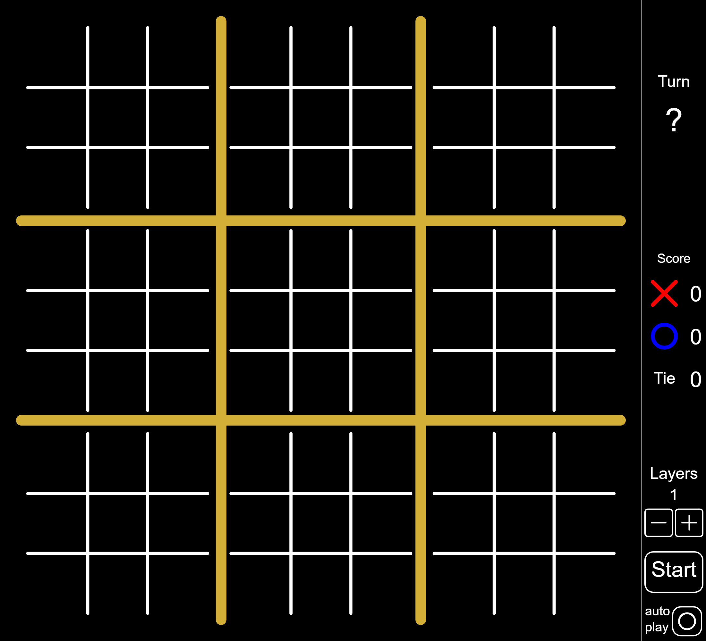
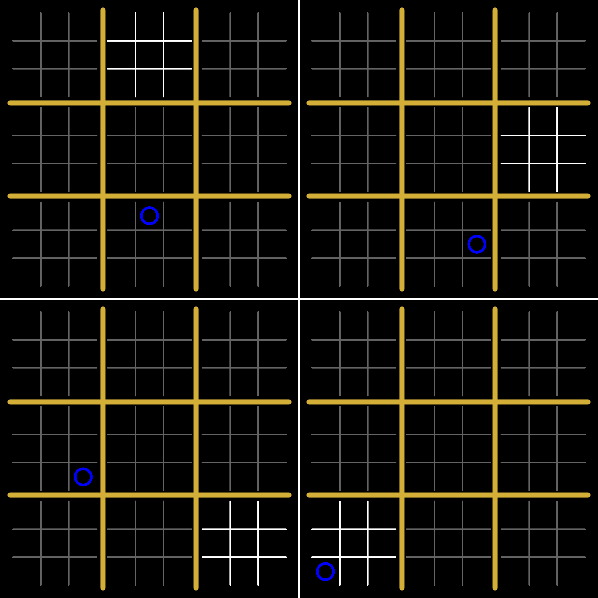
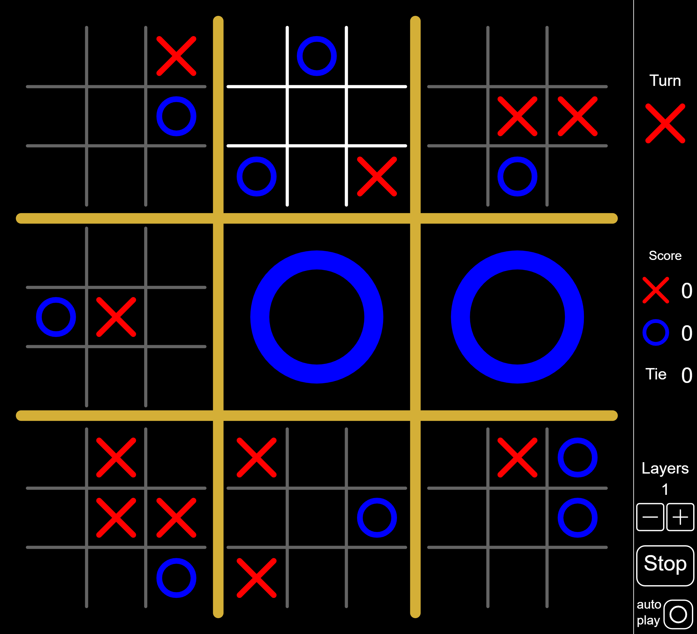

# Ultra tic-tac-toe

Este repositório contém um Jogo da velha diferenciado, programado em *JavaScript*. A biblioteca [p5.js](https://p5js.org/), da fundação [Processing](https://processingfoundation.org/), foi essencial para construir o jogo. Esta biblioteca facilita o uso do *Canvas*, nativo do HTML, e possibilita desenhar linhas, formas e textos com poucas linhas de código.

## Jogue sem download, no link

<https://thiagomaxpavao.github.io/ultra-tic-tac-toe>

## Funcionamento do jogo

Em um jogo da velha normal, basta conseguir três peças em sequência para ganhar o jogo, neste programa, isso é levado à outro nível. E se cada casa do tabuleiro fosse outro, pequeno, jogo da velha?

Com isso criamos um jogo conhecido como “Super jogo da velha”, o funcionamento é interessante: O primeiro jogador pode jogar em qualquer uma das 81 casas disponíveis. No entanto, sua escolha afetará as possibilidades de jogada do próximo jogador, ao escolher um local, o jogador restringe a jogada do próximo jogador ao pequeno jogo da velha na posição equivalente à que foi feita a jogada do jogo da velha principal. Veja abaixo quatro exemplos de primeira jogada

Como é possível ver nos exemplos, após a jogada do *círculo*, a proxíma jogada deve ocorrer no pequeno jogo da velha na mesma posição em que a jogada foi feita, porém do tabuleiro principal. O local em que a jogada deve ser feita é sinalizada pelo programa, deixando o local branco, enquanto os outros tabuleiros são escurecidos.

O jogo segue assim, quando um dos jogadores ganha em um dos pequenos jogos da velha, este deixa de existir e dá lugar ao simbolo do vencedor, o jogo termina quando um dos jogadores vence no tabuleiro principal, ou quando não há mais jogadas a serem feitas, neste caso é considerado velha.

Este funcionamento pode ser extendido, inserindo tabuleiros ainda menores dentro dos pequenos. Muitos dos casos de jogadas que podem ocorrer em um jogo real não foram explicados aqui, mas certamente a melhor maneira de aprender é experimentando com o jogo.

## Auto Play

Adicionei também uma funcionalidade de jogadas automáticas, quando ativada, o jogo continuamente analisa as opções de jogada, escolhe uma aletoriamente e realiza a jogada, isso foi feito apenas com o intuito de visualizar o jogo funcionando com várias camadas rapidamente, uma vez que seria impossível convencer alguém à jogar um jogo da velha que dure 10 horas. Esta funcionalidade pode ser ativada/desativada a qualquer momento.

## História

Programei meu primeiro jogo da velha, o normal, quando ainda estava começando a aprender a programar, o resultado do jogo pode ser visto [aqui](https://thiagomaxpavao.github.io/ultra-tic-tac-toe/normal/index.html), apesar de funcional, percebo agora que a estética poderia ser muito melhorada, e que o programa poderia ter sido feito de uma maneira muito mais inteligente.

Esta última observação se torna gritante no caso do próximo jogo da velha que fiz, a versão digital do Super jogo da velha, o resultado pode ser visto [aqui](https://thiagomaxpavao.github.io/ultra-tic-tac-toe/super/index.html). Neste programa realizei a proeza de não utilizar nenhum loop, acredito que na época não tenha sido capaz de pensar em algumas lógicas que facilitariam muito escrever o código, e que fariam com que ele não tivesse quase 4000 linhas.

Vendo como esta última versão poderia ser melhorada, começei a trabalhar nessa versão, que batizei de Ultra jogo da velha. Fiz o programa utilizando orientação a objetos e muita recursão, de forma que a lógica recursiva do jogo fosse aproveitada também no código. Isso possibilitou criar este incrível programa com apenas 700 linhas de código. Copio aqui novamente o link para esta versão:

<https://thiagomaxpavao.github.io/ultra-tic-tac-toe>